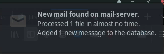

# Table of Contents

1.  [\* \* \* \* export DISPLAY=:0 && /path/to/the/folder/notmuchnotifications/target/release/notmuchnotifications](#orgd70ad18)

---

This is a very simple Rust program designed to check a remote mail server where notmuch is setup and provide a notification on your client computer if new mail has arrived. It also plays a small wav file as part of the notification.

To use it, first ensure you can SSH into your mail server without a password. Then do the following:

    git clone thisrepo

Now, edit the src/main.rs file and change the following parts to your use case:

    mail@mail-server # Your username and mail server.
    /home/tatsu/Programming/notmuch_notifications/media/spock_mail.wav # The location of your chosen notification sound file.

Build the release in the folder:

    cargo build --release

The code is now ready. We can set up the cron job now to run every minute (or whatever you prefer). Note that the DISPLAY=:0 portion is necessary:

\#+BEGINSRC bash

# \* \* \* \* export DISPLAY=:0 && /path/to/the/folder/notmuchnotifications/target/release/notmuchnotifications

\#+ENDSRC

This should produce the following notification when you receive new mail:

